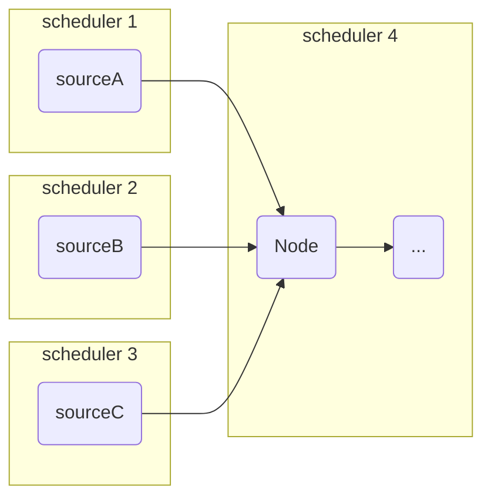
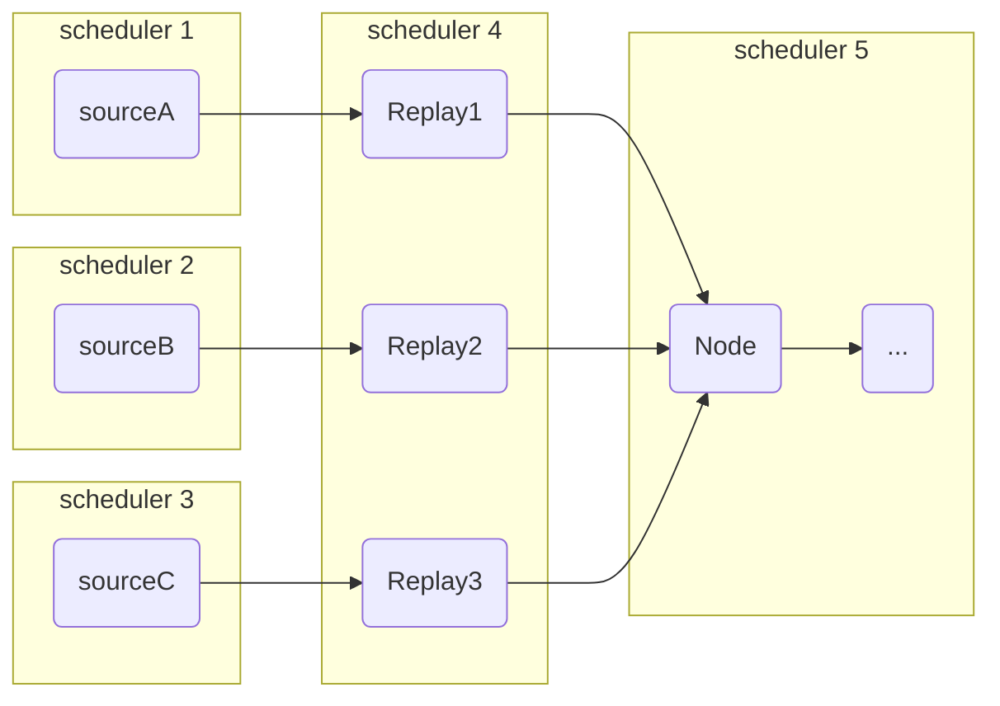
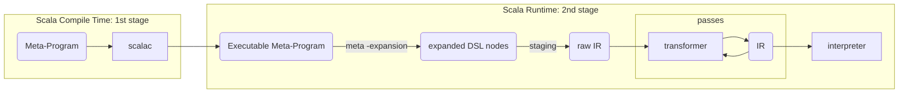

## Outline

1. **Rao-Blackwellized Particle Filter** for **POSE**
2. **Scala-flow**
3. An **interpreter** for Spatial
4. **Spatial implementation** of the RBPF.

<div class="notes">
1. Adapted a novel more accurate algorithm to the context of POSE estimation of drones: **Rao-Blackwellized Particle Filter**
2. Built a **simulation framework**: **scala-flow**
3. Created an **interpreter** for scala-flow integration of spatial
3. **Implemented** the RBPF in hardware with **Spatial**
</div>

# Introduction 

## Decline of Moore's law

{width=70%}

## Rise of hardware's importance

FPGA key advantages: 

- **Perf/Watt**
- high throughput
- low latency

## Industry is moving to hardware

Any HPC task can benefit from hardware:

- **Financial industry** (High-Frequency Trading) relies on FPGA
- **Microsoft** and **Baidu** use FPGA inside their data centers
- **Google** uses TPU to accelerate deep learning in the cloud

## Spatial to ease transition

- Writing hardware is **hard**: An application has to be written in an **HDL**
- **Spatial** is a high-level **HDL**, implemented as a **DSL** embedded in **Scala**
- The abstraction level bridges the gap between software and electrical engineers

# Rao-Blackwellized Particle Filter for POSE estimation

## Motivation

<iframe width="560" height="315" src="https://www.youtube.com/embed/kdlhfMiWVV0" frameborder="0" allowfullscreen></iframe>

## Drones


## POSE estimation

Tracking through time:

- **position** 
- **orientation** (called attitude) 

from

- linear acceleration (**accelerometer**)
- angular velocity (**gyroscope**)
- position and orientation (**VICON**)

## Sensor fusion

The VICON has a **low** sampling rate, so we want use the inertial measurements **in-between**.

Each sensor has a noise that we can reduce by combining the different inputs

## Problem

- The orientation does not belong to a **vector space** but to $SO(3)$
- Orientations are reprensented with **quaternions**: 4D complex numbers
- The transformations through time are non-linear 
- Mathematically, this is much harder to formalize

## Trajectory data generation

- Fixed number of randomly generated checkpoints
- Checkpoints have Position, Velocity* and Acceleration*
- Closed form solutions exist for the ODE constrained on maximal thrust and angular momentum.

*: Optional

## 

<video autoplay loop width="70%">
  <source src="images/flight.webm" type="video/webm">
</video>

## Filtering

Given the current and previous observations, calculate the expected current state.

$$\mathbb{E}[\mathbf{s}_t | \mathbf{z}_{1:t}]$$

## Bayesian inference

"Bayesian inference is a method of statistical inference in which Bayes' theorem is used to update the probability for a hypothesis as more evidence or information becomes available" 

$\Rightarrow$

Update the model's probability distribution according to new observations 

## Kalman Filter

**Assumptions**: The transformation from the model dynamics must be linear

The state (position and orientation) is kept track of as a gaussian distribution.

linear transformation of a gaussian distribution is a new gaussian distribution

next state gaussian from model dynamics is combined with state from observation to compute the new gaussian

## 


## Extended Kalman Filter

To extend the Kalman Filter to non-linear transformations

linearize the transformation with the Jacobian.

## Unscented Kalman Filter

The jacobian apply the same linearized transformation to every element of the distribution

But the tail might require a very different transformation

The distribution is here represented with sigma points (representative of the distribution).

The **sigma points** are transformed individually and represent the distribution

##


## Particle Filter

Particle filters also keeps multiple representative of the distribution: Particles instead of sigma points

Each particle has a weight attached to it, which is its importance to represent the distribution. This is **importance sampling**

## Rao-Blackwellized Particle Filter

Each particle, instead of representing a state, represent a distribution of the state. 

Kalman filtering is used to update the individual states. Best of both world: 

- non-linear components are latent variables updated with the particle filter
- linear components are updated with Kalman filtering (and asynchronous with partial Kalman update)

## 

The most accurate and mathematically sound algorithm

But the most computationally expensive

embarrassingly parallel, hardware is a good fit

## Result


##


# Scala-flow

A simulation tool for data-flows with a Spatial integration 

## Data-flow

[](https://asciinema.org/a/YCr4mxI2j90T0alUHZzHY56vv)

## Packet

Each packet is typed, contains a timestamp of creation and the total delay it has been through

## Node

A node is a processing component of the data-flow. It has an arbitrary number of input and 1 output. 

The input and output is typed

## Block

A Block is a group of node that can be seen from the outside as a single node

## Batch

A Batch is a node that process internally the elements all at once. 

Scheduler ensure correctness of the simulation when different batch are input of the same node.

## Scheduler



##




## Functionnal API

```
val sa: Source[A]
val sb: Source[B]
val sla: Source[List[A]]
def f(x: A): C
def b(x: A): Boolean

sa.map(f): Source[C]
sa.zip(sb): Source[(A, B)]
sab.unzip: (Source[A], Source[B])
sa.merge(sb): Source[Either[A, B]]
sa.fusion(sa): Source[A]
sa.foreach(f): Source[A]
sa.filter(b): Source[A]
sa.drop(n): Source[A]
sa.accumulate(clock): Source[List[A]]
sa.groupBy(A => B): Source[(B, A)]
sla.reduce(r): Source[A]
sa.takeWhile(b): Source[A]
sa.muted: Source[B]
sa.toTime: Source[Time]
sa.latency: Source[A]
sa.debug //print packets as they arrive
//and more ...
composable
sa.zip(sb).map(g).filter(c) ...
```

# Interpreter for Spatial

## 

[](https://asciinema.org/a/twkwh0Wt2vAjMQFLu6fqGVWK7)

## Compiler

The compiler runs at scala runtime

It is implemented on top of Argon, a fork of LMS, developped here by Tiark

## 



```mermaid
graph LR
  subgraph Scala Compile Time: 1st stage
  prog(Meta-Program)
  scalac
  end
  subgraph Scala Runtime: 2nd stage
  exec(Executable Meta-Program)
  expanded(expanded DSL nodes)
  OIR(raw IR)
  subgraph passes
  transformer
  IR(IR)
  end
  codegen
  target(Chisel Object Program)
  chisel[Chisel Compiler]
  target2(Verilog Program)	
  verilog[Verilog Compiler]	
  target3(Hardware Design)
  end
  prog-->scalac
  scalac-->exec
  exec-->|meta-expansion|expanded
  expanded-->|staging|OIR
  OIR-->transformer
  IR-->transformer
  transformer-->IR
  IR-->codegen
  codegen-->target
  target-->chisel
  chisel-->target2
  target2-->verilog
  verilog-->target3
```

## Interpreter



## Scala-flow integration

Having an interpreter enable to run spatial as a batch node !

# Spatial implementation of the RBPF

## Meta-programmation

The RPBF algorithm is highly factorisable as matrix and vec operations.

Meta-programmation enable 0-cost abstractions

I wrote a Spatial matrix and vec library as a meta-programmable layer

##

Spatial is an embedded scala DSL

The DSL go through the Spatial compiler at runtime

The Spatial program in Scala is expanded into the DSL before going through the Spatial Compiler

It is during this step of "meta-expansion" that the matrix are expanded

also enable dimension check before compilation

##

`scala.List.tabulate(10)(i => DSLNode(i))`

```
DSLNode(0)
DSLNode(1)
...
```
##

```
val a = DenseMatrix(x,y)(...)
val b = DenseMatrix(y,z)(...)
a*b
```

```
val a = RegFile(h,w)(...)
val b = RegFile(h,w)(...)
val c = RegFile(h,w)(...)

Foreach { Foreach { Foreach { ... } } }
```

## Views

Views are part of that matrix library. 

They enable to transpose the matrix, identity matrix and other transformation by changing access as meta-programmation

Also enable to use optimal space and operations for diag or sparce matrices.

## Pipelining

To fit on chip, impossible to duplicate hardware for parrallelization

pipelining was used instead

pipelining require to adjust the code such read and write are as close as possible

else memory must be buffered and the area usage explode

## 

Require to think factorisation in term of memory access instead of function (since all functions are expanded)

# Conclusion

Multi-disciplinary project

From improving algorithm of POSE estimation to their hardware implementation

Real life Demo coming soon

## 

- Self-contained inter-disciplinary work
- Improve state-of-the-art of POSE estimation
- Enhance spatial ecosystem
- Prove that Spatial can be applied to embedded systems

## Thank you!

Questions ?
